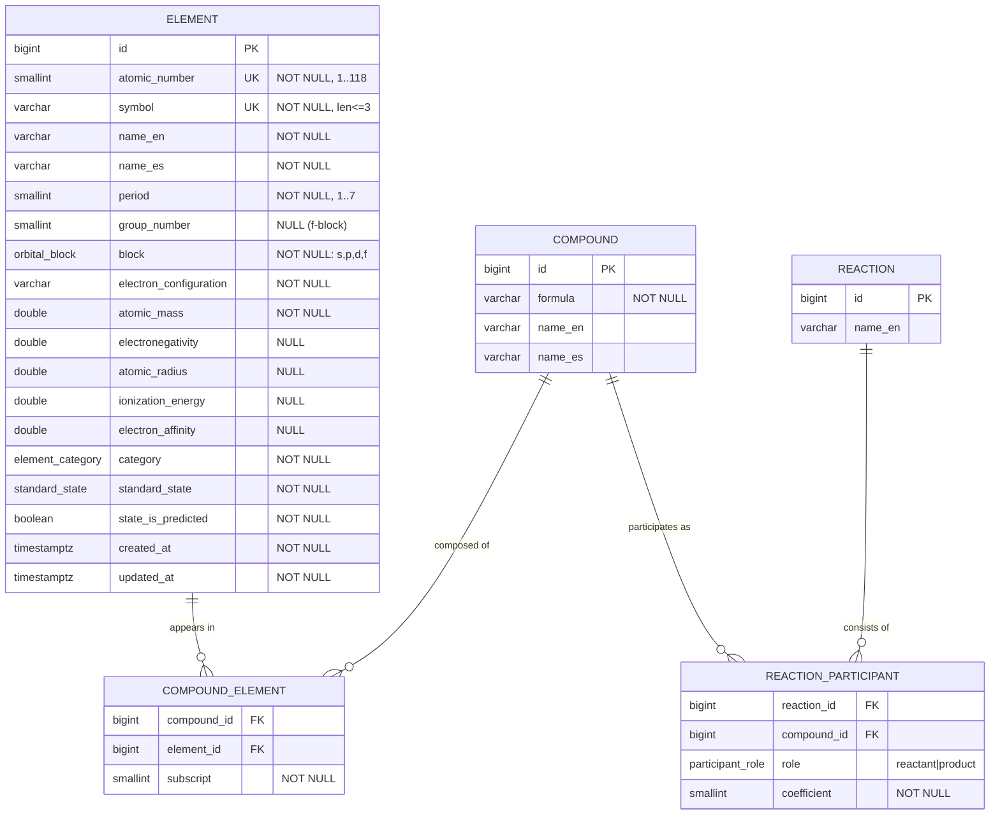

# ADR-0004: Element data model

## Status

Accepted - 2026-06-15

Builds on ADR-0003 (data source). The general localisation strategy for free-text content
is deferred to ADR-0007.

## Context

Phase 1 delivers a REST API serving the 118 chemical elements. Before any SQLAlchemy mapping
(F1-5) or Pydantic schema (F1-8) is written, the `Element` entity needs a formal data model.
This model drives the database schema, the public API contract, the migration and seeding
strategy (ADR-0005 and ADR-0006) and the localisation approach.

The data source was fixed in ADR-0003: the PubChem CSV, vendored into the repository, with all
text in English. Inspecting that dataset surfaces two facts that constrain the design:

1. **Positional fields are not in the source.** The CSV has no group, period or orbital-block
   column. Its `GroupBlock` column is the element **family/category** (10 distinct values:
   Alkali metal, Alkaline earth metal, Transition metal, Post-transition metal, Metalloid,
   Nonmetal, Halogen, Noble gas, Lanthanide, Actinide), not a group number plus block. Group,
   period and block must therefore be **enriched** during seeding, derived from the atomic
   number and the electron configuration. This couples the model to ADR-0006.
2. **The source has real gaps.** Out of 118 rows, the following counts are empty:
   `electron_affinity` 61, `electronegativity` 23, `density` 22, `boiling_point` 25,
   `atomic_radius` 19, `ionization_energy` 16, `melting_point` 15, `atomic_mass` 0. These
   counts dictate which property columns must be nullable.

The audience is Spanish secondary and pre-university students (see the Vision document), so the
element name must be available in Spanish, while the dataset provides only English.

This ADR designs the model only. Implementing the ORM mapping, the Alembic migration and the
Pydantic schemas are tracked separately and are out of scope here.

## Decision

### Identity and keys

A surrogate `id` is the primary key. `atomic_number` and `symbol` are modelled as unique,
non-null alternate keys. The public API addresses elements by symbol (`GET /elements/{symbol}`),
and the unique constraint on `symbol` guarantees that external identifier is stable without it
being the primary key.

The surrogate key is chosen over the natural `atomic_number` because the entities planned for
Phase 2/3 (compounds, reactions, exercises) will reference elements through foreign keys. A
single integer surrogate gives those relationships a uniform target and keeps the internal
identity independent of chemical semantics; the natural key remains enforced as a unique
constraint, so no domain integrity is lost.

### MVP fields

| Column | Type | Nullability | Constraints / notes |
| --- | --- | --- | --- |
| `id` | bigint (identity) | NOT NULL | Primary key |
| `atomic_number` | smallint | NOT NULL | UNIQUE; `CHECK BETWEEN 1 AND 118` |
| `symbol` | varchar(3) | NOT NULL | UNIQUE; current max length is 2, with headroom for provisional IUPAC symbols |
| `name_en` | varchar(50) | NOT NULL | English name (from source) |
| `name_es` | varchar(50) | NOT NULL | Spanish name (curated) |
| `period` | smallint | NOT NULL | `CHECK BETWEEN 1 AND 7`; enriched |
| `group_number` | smallint | NULL | `CHECK BETWEEN 1 AND 18`; null for the f-block; enriched. Named `group_number` because `GROUP` is a reserved SQL keyword |
| `block` | enum `orbital_block` | NOT NULL | One of `s`, `p`, `d`, `f`; enriched |
| `electron_configuration` | varchar(50) | NOT NULL | e.g. `1s2 2s2 2p6` |
| `atomic_mass` | double precision | NOT NULL | Present for all 118 rows |
| `electronegativity` | double precision | NULL | 23 source gaps |
| `atomic_radius` | double precision | NULL | 19 source gaps |
| `ionization_energy` | double precision | NULL | 16 source gaps |
| `electron_affinity` | double precision | NULL | 61 source gaps |
| `category` | enum `element_category` | NOT NULL | The 10 family values; mapped from `GroupBlock` |
| `standard_state` | enum `standard_state` | NOT NULL | One of `solid`, `liquid`, `gas` |
| `state_is_predicted` | boolean | NOT NULL | Default `false`; see normalisation below |
| `created_at` | timestamptz | NOT NULL | Default `now()` |
| `updated_at` | timestamptz | NOT NULL | Default `now()`, updated on write |

The MVP retains the curricular properties named in ADR-0003 (atomic radius, electronegativity,
ionisation energy, electron affinity, electron configuration) so the model stays consistent with
the criteria that justified the data source. They are nullable because the source omits them for
the elements listed above.

### Category modelled as a native enum

`category` is a native typed enum rather than a lookup table. The set of element families is
closed and changes only when the scientific community defines a new classification, which is a
rare event; an enum provides database-level integrity, static typing in Python (usable by mypy
and Pydantic), and avoids a join on every element read.

The consequence is that the Spanish labels for the family names cannot be stored in the database
alongside the enum. They become an application-layer concern, handled by the general i18n work in
ADR-0007. The same reasoning applies to `standard_state`.

### Standard-state normalisation

The source `StandardState` column carries five values: `Solid`, `Liquid`, `Gas`, and the two
predictions `Expected to be a Solid` and `Expected to be a Gas` (used for synthetic elements whose
state has not been measured). The model splits this into two columns: a `standard_state` enum
restricted to `solid` / `liquid` / `gas`, and a `state_is_predicted` boolean. This separates the
physical state from its epistemic status, so queries and filters operate on a clean three-value
field while the prediction caveat is preserved.

### Localisation

Only one field on `Element` varies per row by language: the name. Symbols, electron
configurations and numeric properties are language-independent. The model therefore stores
**dual columns**, `name_en` and `name_es`. Runtime or machine translation is rejected because
chemical names are domain terminology with fixed equivalents (for example *tin* maps to
*estaño*), not free text amenable to automatic translation.

A general internationalisation mechanism (a translations table or equivalent) is justified once
the application holds free-text content in several languages: exercise statements, hints, compound
names and chemical-law descriptions in Phase 2/3. Introducing that abstraction now, for a single
field on one entity, would add structure the MVP does not use. The general strategy is deferred to
ADR-0007, which this ADR references.

### Forward-compatible relationships

`Element` remains a reference table with no columns describing compounds or reactions. The schema
grows through new tables that reference `element.id`:

- `compound_element(compound_id, element_id, subscript)` — a many-to-many composition table
  carrying the stoichiometric subscript, linking compounds to their constituent elements.
- `reaction_participant(reaction_id, compound_id, role, coefficient)` — reactions reference
  compounds, with a `role` enum (`reactant` / `product`) and a balancing coefficient.

Exercises in Phase 2/3 will reference elements, compounds or reactions depending on their type.
`oxidation_states` is deferred (see below) but is noted as the bridge field that compound-formation
logic will reintroduce, since valence governs which compounds an element can form.

### Entity diagram

The diagram shows the MVP `Element` entity together with the planned Phase 2/3 entities, included
to make the forward-compatible key strategy explicit. Only `Element` is built in this phase; the
other tables are shown for context and are not created here.

### Deferred fields

| Field | Reason for postponement |
| --- | --- |
| `oxidation_states` | Bridge field for compound formation; reintroduced in Phase 2 when valence is needed |
| `melting_point`, `boiling_point`, `density` | Thermodynamic properties outside the MVP consumer set; also gappy in the source |
| `cpk_hex_color` | Presentation concern, owned by the frontend |
| `year_discovered` | Historical metadata with no MVP consumer |
| `isotopes` | Absent from the CSV; a separate future entity sourced via PubChem PUG-REST, as anticipated in ADR-0003 |

Adding any of these later is a column-adding migration, which is low-cost; removing a column that
turned out to be unused is more disruptive. The MVP therefore starts narrow.

## Consequences

### Positive

- **Lean, implementable schema:** a single table with typed columns is quick to map, migrate and
  seed, and matches the MVP consumer (list and detail endpoints over 118 elements).
- **Stable foreign-key target:** the surrogate primary key lets Phase 2/3 entities reference
  elements without coupling those relationships to a chemical number, while the unique constraints
  on `atomic_number` and `symbol` preserve domain integrity.
- **Type safety without joins:** the `element_category`, `standard_state`, `orbital_block` and
  `participant_role` enums enforce closed sets at the database level and are statically typed in
  Python, with no join cost on element reads.
- **Honest representation of the source:** nullable property columns model the documented gaps
  rather than inserting placeholder values.
- **Audience fit with minimal structure:** dual name columns serve the Spanish-first audience for
  the only per-row translatable field, without an i18n abstraction the MVP would not exercise.

### Trade-offs

- **Enrichment dependency:** `group_number`, `period` and `block` are not seedable from the raw
  CSV; the seeding step (ADR-0006) must derive them, so the model is not loadable from the source
  artefact alone.
- **Enum localisation moves to the application layer:** with `category` and `standard_state` as
  enums, their Spanish labels live outside the database (ADR-0007). If category metadata later
  needs to be managed at runtime, migrating the enum to a lookup table would be required.
- **Enum changes need a migration:** adding a value (for example a new element family) is an
  `ALTER TYPE`, heavier than inserting a lookup row. This is accepted given how rarely the set
  changes.
- **Sparse curricular column:** `electron_affinity` is empty for roughly half the elements; it is
  retained for curricular completeness per ADR-0003, and consumers must handle its absence.
- **Deferred bridge field:** omitting `oxidation_states` means Phase 2 compound logic will
  reintroduce it through a migration.

## Alternatives considered

- **Natural primary key (`atomic_number`):** immutable and a clean fit for the periodic table, but
  it would make every future foreign key carry chemical semantics and reduce uniformity across the
  schema. Retained instead as a unique alternate key, which keeps its integrity guarantee without
  the coupling.
- **Category as a lookup table:** would allow Spanish family labels and any future category
  metadata to live in the database and be edited without a migration, at the cost of a join on
  reads and an extra table for a set that rarely changes. The enum's static typing and join-free
  reads were preferred for the MVP; ADR-0007 may revisit this if i18n is centralised.
- **Single English name field:** rejected because the audience is Spanish students and chemical
  names are not reliably machine-translatable.
- **A general translations table now:** appropriate once free-text multilingual content exists
  (exercises, hints, laws), but premature for a single field on one entity. Deferred to ADR-0007.
- **Wide MVP including all CSV columns:** rejected on a you-aren't-gonna-need-it basis; the
  thermodynamic and historical columns have no MVP consumer, and adding them later is a low-cost
  migration.
