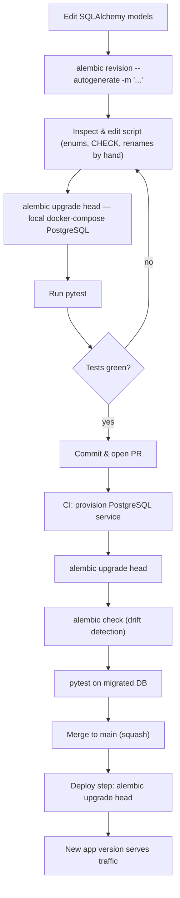

# ADR-0005: Database migration strategy

## Status

Accepted - 2026-06-15

Builds on ADR-0002 (backend stack) and ADR-0004 (data model). Reference-data seeding and dataset
enrichment are deferred to ADR-0006.

## Context

ADR-0002 fixed the backend stack as SQLAlchemy 2.0 (async) over PostgreSQL and left the choice of
migration tool to a dedicated ADR. With the Element data model defined in ADR-0004, the project
needs a documented, repeatable way to evolve the database schema across local, CI and production
environments before any schema is materialised. This decision governs how schema changes are
authored, reviewed, and applied.

Two earlier decisions constrain the approach:

- **Async engine (ADR-0002).** The application connects through an async driver (asyncpg), which
  affects how the migration environment is configured.
- **Native enums and `CHECK` constraints (ADR-0004).** The model uses PostgreSQL enum types
  (`element_category`, `standard_state`, `orbital_block`) and range `CHECK` constraints. Both
  interact with Alembic's autogeneration in ways that require explicit handling.

This ADR documents the strategy only. Initialising Alembic and writing the first migration are
tracked as F1-5; the seed script and the dataset enrichment are deferred to ADR-0006.

## Decision

### Tool: Alembic

Alembic is adopted as the migration tool. It is built for SQLAlchemy and compares the declarative
metadata the models already define against the live database, so it can generate revision scripts
from that diff. It produces ordered, versioned revisions chained through `revision` /
`down_revision`, each with explicit `upgrade()` and `downgrade()` functions, and it supports async
engines. These mechanisms give the project a reviewable, reproducible schema history.

### Async configuration and connection management

Alembic's `env.py` uses an async engine with the same asyncpg driver as the application, and reads
the database URL from the pydantic-settings `Settings` object rather than the hardcoded
`sqlalchemy.url` in `alembic.ini`. Concretely, `env.py` imports `Settings`, injects the URL at
runtime, and runs migrations through Alembic's async pattern, in which the migration body executes
synchronously via `connection.run_sync(do_run_migrations)`.

The migration body therefore runs synchronously even on the async engine; async here is connection
plumbing, not a performance gain. The reason for choosing the async engine anyway is to keep a
single driver and a single source of connection configuration; the dedicated-sync-driver option is
recorded under Alternatives. Reading the URL from `Settings` avoids committing environment-specific
credentials to `alembic.ini` and keeps one source of truth for connection settings.

### File naming convention

Revision files are named `YYYYMMDD_HHMM_<short_description>.py`, configured through `file_template`
in `alembic.ini`. The timestamp prefix gives human-readable chronological ordering when listing the
directory; the authoritative ordering remains the `revision` / `down_revision` chain inside the
files, not the filename. The Alembic-generated revision identifier is kept as the in-file revision
id.

### Autogeneration policy

Autogenerate is used as a starting point and is never committed uninspected: every generated
revision is read and edited before commit. The following cases are known not to be handled by
autogenerate and are written by hand with `op.execute(...)` or explicit operations:

- **Native enum value changes.** Adding, removing or renaming PostgreSQL enum values is not
  detected; the corresponding `ALTER TYPE` statements are written manually.
- **`CHECK` constraints.** Alembic does not autogenerate `CHECK` constraints, so the range checks
  from ADR-0004 (`atomic_number`, `period`, `group_number`) are added by hand.
- **Renames.** A column or table rename is emitted as a drop plus an add; an intended rename is
  rewritten as an alter operation to avoid discarding data.
- **Server defaults and some type changes** are detected inconsistently and are verified manually.

This policy exists because applying unreviewed autogenerated migrations is a recognised source of
production incidents, such as silent data loss from a misread rename or a missing constraint.

### Workflow

- **Local.** Change the models, run `alembic revision --autogenerate -m "<description>"`, inspect
  and edit the generated script per the rules above, run `alembic upgrade head` against the
  docker-compose PostgreSQL, then run the test suite.
- **Development.** The same `upgrade head` is applied to any shared development database as part of
  normal work.
- **CI.** The pipeline provisions a PostgreSQL service, runs `alembic upgrade head` to build the
  schema, and runs `pytest` against that migrated database. A separate `alembic check` step fails
  the build when the models have diverged from the committed migrations (drift detection).
- **Production.** Migrations run as an explicit, ordered deploy step (`alembic upgrade head`) before
  the new application version serves traffic. Migrations do not run automatically on application
  startup, which would race across multiple instances and couple schema changes to process boot.

### Rollback

Each schema revision implements `downgrade()` where the operation is reversible, as a convenience
for iterating locally. In production, the primary recovery path is roll-forward — a new corrective
migration — combined with database backup and restore, because several operations cannot be
reversed without data loss: dropping a column discards its data, and `ALTER TYPE ... ADD VALUE`
cannot be undone by removing the value. `downgrade()` is therefore treated as a local development
tool, not a production safety net.

### Schema migrations vs data migrations, and seeding

Schema migrations (DDL) and data migrations (DML / backfills) are kept in separate revisions where
practical, so structural and data changes can be reasoned about and reverted independently. Any
data migration is written with idempotency and reversibility in mind.

Loading the reference dataset (the 118 elements and their enrichment) is explicitly **not** an
Alembic data migration. It is performed by a separate, idempotent seed script. Reference data that
may be re-derived or corrected should not be frozen into the immutable migration history; an
idempotent script (upsert) can be re-run safely across local, CI and production; and the migration
history stays purely structural. The mechanics of the seed — the source of `name_es`, the
derivation of `group_number` / `period` / `block`, the handling of the `(predicted)` suffix, and
the idempotency strategy — are deferred to ADR-0006.

## Consequences

### Positive

- **Reviewable, reproducible history:** versioned revisions give a schema that can be rebuilt
  identically across environments and inspected in review.
- **Single driver and single config source:** using asyncpg and reading the URL from `Settings`
  reduces drift between the application and its migrations.
- **Drift caught before merge:** `alembic check` in CI flags models that have diverged from the
  committed migrations.
- **Schema changes decoupled from boot:** the explicit production deploy step avoids multi-instance
  races and keeps application startup independent of migration state.
- **Re-runnable seeding:** separating reference-data loading from migrations keeps history
  structural and lets the seed be re-applied safely.

### Trade-offs

- **Async boilerplate:** the async `env.py` is more verbose than the synchronous default, for a
  migration body that runs synchronously regardless.
- **Manual DDL remains necessary:** enums and `CHECK` constraints are outside autogenerate, so
  autogeneration is not a complete solution and needs ongoing manual care.
- **Downgrade authoring cost:** writing `downgrade()` adds effort that production will rarely use.
- **Drift-check tuning:** `alembic check` adds a CI step and can raise false positives on
  dialect-specific reflection edge cases, needing occasional adjustment.

## Alternatives considered

- **Dedicated synchronous driver (psycopg) for migrations:** yields a simpler `env.py` and avoids
  async plumbing around a synchronous operation. Not chosen as the default because it adds a second
  driver dependency and requires transforming the async URL, which works against the single-driver
  benefit. It remains a low-cost fallback if the async pattern causes friction.
- **Atlas:** a language-agnostic schema-as-code tool with strong diffing. Rejected because it
  introduces a non-Python toolchain and a separate schema definition that would duplicate the
  SQLAlchemy metadata already maintained, for no benefit at the MVP scale.
- **Raw, hand-numbered SQL scripts:** maximal control and transparency, but loses autogeneration,
  the model-to-schema comparison and the revision graph, which raises maintenance cost and the risk
  of ordering errors.
- **`metadata.create_all()` with no migration tool:** trivial for a greenfield schema, but it keeps
  no version history and offers no path to evolve a populated production database, which the project
  requires from Phase 1 onward. Retained only as a possible convenience in throwaway test setups.
