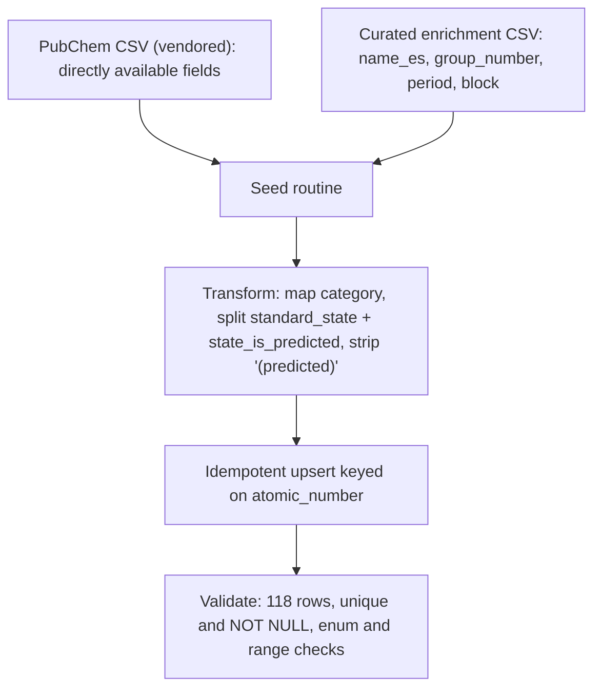

# ADR-0006: Element dataset seeding and enrichment

## Status

Accepted - 2026-06-15

Builds on ADR-0003 (data source), ADR-0004 (data model) and ADR-0005 (migration strategy).

## Context

ADR-0004 defined the Element model and deferred the production of fields that are absent from the
source (`group_number`, `period`, `block`, `name_es`) to a later ADR. ADR-0005 decided that
reference data is loaded by a separate idempotent seed script — not an Alembic data migration — and
delegated the seed's mechanics to this ADR.

The base dataset is the PubChem CSV vendored in ADR-0003. It provides most fields directly, but
three categories of work remain before the 118 elements can be persisted against the ADR-0004
schema:

- **Fields not present in the source:** `group_number`, `period`, `block` and `name_es`.
- **Fields needing normalisation:** `GroupBlock` must map to the `element_category` enum;
  `StandardState` carries predicted variants that must split into `standard_state` plus
  `state_is_predicted`; `ElectronConfiguration` carries a `(predicted)` suffix on some rows.
- **Operational concerns:** idempotency, where the seed runs, and how the result is validated.

This ADR documents the strategy. Implementing the seed script and the enrichment code is tracked
separately (F1-6).

## Decision

### Input source and enrichment artifact

The seed reads two inputs, both versioned in the repository and keyed by atomic number:

1. The vendored PubChem CSV (ADR-0003), which supplies the directly available fields.
2. A single curated enrichment CSV that supplies the fields the source lacks: `name_es`,
   `group_number`, `period` and `block`.

The seed joins the two on atomic number, applies the normalisation rules below, and upserts the
result. Keeping all curated data in one reviewable, diff-able file gives a single source of truth
for everything that is not taken verbatim from PubChem.

### Positional fields (`group_number`, `period`, `block`): curated lookup

The positional fields are taken from the curated enrichment CSV, not derived algorithmically.

The element set is fixed and fully known, and group classification carries several exceptions —
anomalous d- and f-block configurations, and the La/Ac versus Lu/Lr group-3 ambiguity — that an
algorithm would have to special-case. A curated, version-controlled table is deterministic and can
be reviewed row by row, which is a smaller risk surface than derivation code for 118 known elements.
Period is in fact derivable without exceptions from atomic-number ranges, and block is derivable
from the last occupied subshell except for helium; both are nonetheless kept in the curated table so
that all positional data has one auditable source rather than being split between code and file (see
Alternatives).

Two edge cases are recorded explicitly so they are not later mistaken for errors:

- **f-block:** lanthanides and actinides have `group_number` set to null.
- **Helium:** `block` is `s` (configuration `1s2`), even though helium is placed in group 18 with
  the noble gases.

### Spanish names (`name_es`): curated source

`name_es` is curated in the enrichment CSV. The reference authority is the IUPAC element names in
their Spanish form as standardised by the Real Sociedad Española de Química. As noted in ADR-0004,
these names cannot be derived and constitute a genuine maintenance dependency: changes are reviewed
like any other content change.

### Category mapping

The seed maps the PubChem `GroupBlock` string to the `element_category` enum defined in ADR-0004.
The ten source values map one to one:

| `GroupBlock` (source) | `element_category` |
| --- | --- |
| Alkali metal | `ALKALI_METAL` |
| Alkaline earth metal | `ALKALINE_EARTH_METAL` |
| Transition metal | `TRANSITION_METAL` |
| Post-transition metal | `POST_TRANSITION_METAL` |
| Metalloid | `METALLOID` |
| Nonmetal | `NONMETAL` |
| Halogen | `HALOGEN` |
| Noble gas | `NOBLE_GAS` |
| Lanthanide | `LANTHANIDE` |
| Actinide | `ACTINIDE` |

The enum member spellings above are illustrative; the authoritative definition lives with the model
(ADR-0004). The seed normalises source casing and spacing to the enum members and fails on any
unmapped value, so a future change to the source vocabulary surfaces immediately.

### Standard-state normalisation

The five source `StandardState` values are split into the `standard_state` enum and the
`state_is_predicted` boolean:

| `StandardState` (source) | `standard_state` | `state_is_predicted` |
| --- | --- | --- |
| Solid | `solid` | false |
| Liquid | `liquid` | false |
| Gas | `gas` | false |
| Expected to be a Solid | `solid` | true |
| Expected to be a Gas | `gas` | true |

The source contains no "Expected to be a Liquid" value.

### Electron configuration: strip the `(predicted)` suffix

The seed stores the clean configuration string, stripping the trailing `(predicted)` marker. The
nine elements that carry it (Cn, Ds, Fl, Lv, Mc, Nh, Og, Rg, Ts) are exactly the nine flagged by
`state_is_predicted`, so the prediction status is already represented at the model level. Retaining
the textual marker, or adding a dedicated `config_is_predicted` column, would duplicate that signal
and, in the column case, require amending ADR-0004 for no model-level gain.

### Idempotency

The seed performs an upsert keyed on the natural key `atomic_number`: each row is inserted if
absent and updated if present. Re-running the seed therefore converges to the same state and is safe
to repeat, which is what allows it to run on every deploy (see below). The concrete upsert mechanism
is an implementation detail of F1-6.

### Execution contexts and ordering

The seed always runs after the schema exists, that is after `alembic upgrade head`, because it
depends on the tables and enum types being present.

- **Local:** run after migrating the docker-compose PostgreSQL.
- **CI:** run inside the integration-test fixtures that require populated data; unit tests that do
  not touch the database do not run it.
- **Production:** run as an explicit post-migration step on each release. Because it is idempotent,
  repeating it across releases is safe.

### Validation

After seeding, the routine verifies the result and aborts (failing the local run or the deploy step)
if any check fails: the row count is 118; `atomic_number` is unique and contiguous over 1–118;
`symbol` is unique; all `NOT NULL` columns are populated; and all enum and range values are valid.

### Seed data flow

## Consequences

### Positive

- **One auditable source of enrichment:** a single curated CSV makes every non-PubChem value
  reviewable and diff-able, with no derivation code to test or special-case for the exception-prone
  group classification.
- **Safe to repeat:** the idempotent upsert runs identically across local, CI and production, and
  can be re-applied on every deploy.
- **No model change for predicted data:** stripping `(predicted)` relies on the already-present
  `state_is_predicted`, avoiding a redundant column and an ADR-0004 amendment.
- **Structural migration history preserved:** keeping seeding out of migrations (ADR-0005) holds.
- **Fail-fast normalisation:** unmapped category values and failed post-seed checks stop the
  process rather than persisting a silently wrong dataset.

### Trade-offs

- **Manual data to maintain:** the curated CSV, `name_es` in particular, is hand-maintained;
  mistakes are data errors caught only by review and the validation step, not by the type checker.
- **Mild redundancy:** `period` (and largely `block`) are derivable yet curated, accepted to keep a
  single source of truth for position.
- **Lost textual marker:** the raw `(predicted)` annotation on nine configurations is not retained,
  though its meaning is preserved through `state_is_predicted`.
- **Two files to edit for a new element:** adding an element (a rare event) requires updating both
  the vendored dataset and the enrichment file.

## Alternatives considered

- **Algorithmic derivation of `group_number` / `period` / `block`:** removes the curated positional
  data, but group classification needs special handling for d- and f-block anomalies and the group-3
  ambiguity, which raises the chance of subtle, hard-to-verify errors on a fixed, fully-known set.
  Rejected in favour of a reviewable table.
- **Hybrid (derive `period` and `block`, curate `group_number`):** limits curated data to the
  genuinely difficult field, but splits provenance between code and file. A reasonable option;
  rejected to keep one auditable source.
- **A dedicated `config_is_predicted` column:** rejected because it exactly duplicates
  `state_is_predicted` (the overlap was verified) and would require amending ADR-0004 for no
  model-level benefit.
- **Seeding via an Alembic data migration:** rejected in ADR-0005, because it would freeze
  re-derivable reference data into immutable history; restated here for completeness.
- **Machine-translating `name_es`:** rejected in ADR-0004, because chemical names are fixed
  terminology rather than reliably machine-translatable text.
